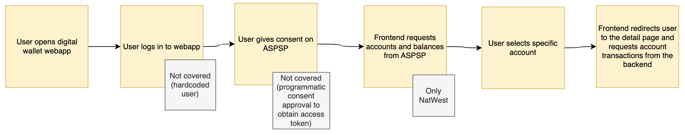
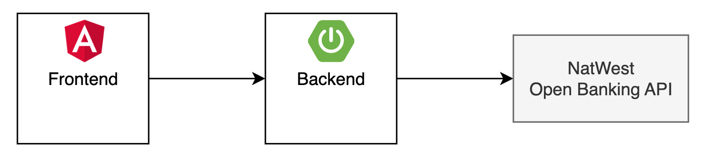
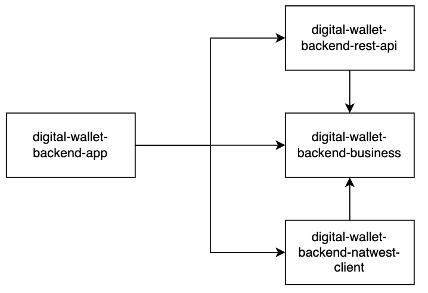

# Scope
The scope of this work increment aims to provide a simple web application integrated with the NatWest API using the Open Banking Standards. The goal is to provide the user with an overview of their bank accounts, including per-account details.

# Constraints
Due to time limitations, some features have been considered out-of-scope, including:
- Proper setup of Authorization and Authentication
- Consent flow
- User management

# Acceptance criteria

### Requirement 1
- **(:white_check_mark: Done)** Die einzelnen Kontostände sowie eine Gesamtsumme über alle Konti hinweg soll sichtbar sein. 
- **(:white_check_mark: Done)** Es ist ersichtlich, welche Summe welchem Konto / Bankbeziehung entstammt. Interaktionen 
- **(:white_check_mark: Done)** Der Benutzer soll mit einem Klick auf ein Konto eine Detailsicht des jeweiligen Kontos kommen. 
- **(:white_check_mark: Done)** Alle Geldbeträge sollen auf 5 Rappen und 2 Dezimal gerundet werden 
- **(:white_check_mark: Done)** Sollte der Kontostand einzeln oder in der Summe negativ sein, so soll die Summe in rot dargestellt werden.

### Requirement 2 (optional)
- **(:white_check_mark: Done)** Transaktionen sollen im Minimum mit Betrag sowie Datum ausgewiesen werden.
- **(:white_check_mark: Done)** Transaktionen sollen nach dem Datum sortierbar sein (auf- und absteigend). 
- **(:white_check_mark: Done)** Alle Geldbeträge sollen auf 5 Rappen gerundet werden
- **(:white_check_mark: Done)** Sollte der Kontostand einzeln oder in der Summe negativ sein, so soll die Summe in rot dargestellt werden.
- **(:white_check_mark: By design)** Prüfung, ob ein Konto zugriffsberechtigt ist (Stichwort „Customer Consent“)

# System overview

- Frontend: Angular Single Page Application
- Backend: Spring Boot Web Application

# Backend Architecture
**[12-Factor App](https://12factor.net/)** serves as a general guideline for the overall design.

**[Hexagonal Architecture](https://en.wikipedia.org/wiki/Hexagonal_architecture_(software))** is applied to facilitate modularity, scalability, and testability by decoupling the core application logic from external dependencies, enabling easier maintenance and evolution of software systems.

Diagram shows the backend modules and their dependencies.

# Improvements
What needs to be done to run and maintain this app in a productive environment?

### Features
- Proper setup of Authorization and Authentication
- Consent flow
- User management
- Error handling
- UX

### Technical
- Deployment based on requirements regarding availability, scalability, etc.
- Frontend to Backend SSL
- CI/CD pipeline
- Automated testing
- Generate REST client from API spec
- Logs and Metrics, Alerting
